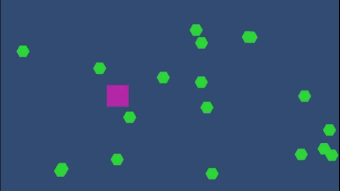

# Collectionable
* Juego estilo coleccionable para practicar conceptos de Unity



---
# Script [Player.cs](https://github.com/MarcoPaoletta/Collectionable/blob/main/Assets/Scripts/Player.cs)

### Variables
```c#
    public int speed;
    public int score;
    public GameObject coin;

    private Rigidbody2D rb;
    private float horizontal;
    private float vertical;
```
* speed = velocidad de movimiento del jugador
* score = puntuacion actual del jugador
* coin = almacena el prefab de cada coin que se va instanciar

* rb = referencia al RigidBody2D
* horizontal / vertical = para el movimiento del jugador

---

### Resetear el juego 
```c#
    void RestartGame()
    {
        if(Input.GetKeyDown(KeyCode.R))
        {
            SceneManager.LoadScene(SceneManager.GetActiveScene().buildIndex);
        }
    }
```
* Si presionamos la letra R, se reiniciara la escena, devolviendo al player a su posicion inicial y volviendo a instanciar los coins 

---

### Limites de la pantalla
```c#
    void ScreenThreshold()
    {
        if(transform.position.x > 8.5f || transform.position.x < -8.5f || transform.position.y > 4.5f || transform.position.y < -4.5f)
        {
            transform.position = new Vector3(0, 0, 0);
        }
    }
```
* Si estamos saliendo fuera de los limites de nuestra pantalla (calculado de manera manual), la posicion del player va a ser 0 en sus 3 ejes

---

### Movimiento horizontal
```c#
    void HorizontalMovement()
    {
        horizontal = Input.GetAxisRaw("Horizontal") * speed; // returns 1 if we are pressing D or -1 if we are pressing A

        if (horizontal < 0.0f) // if we are moving left
        {
            transform.localScale = new Vector3(-1.0f, 1.0f, 1.0f);
        }
        else if (horizontal > 0.0f) // if we are moving right
        {
            transform.localScale = new Vector3(1.0f, 1.0f, 1.0f);
        }
    }
```
* A la variable horizontal creada al inicio, definimos que retorne 1 si se presiona la D o que retorne -1 si se presiona la A y que a ese valor se lo multiplique por la velocidad
* Si el valor de horizontal es menor a 0, es decir, el jugador se esta moviendo hacia la izquierda, la escala local en el eje X va a ser -1
* Si el valor de horizontal es mayor a 0, es decir, el jugador se esta moviendo hacia la derecha, la escala local en el eje X va a ser 1

---

### Movimiento vertical
```c#
    void VerticalMovement()
    {
        vertical = Input.GetAxisRaw("Vertical") * speed; // returns 1 if we are pressing W or -1 if we are pressing S

        if (vertical < 0.0f) // if we are moving down
        {
            transform.localScale = new Vector3(1.0f, -1.0f, 1.0f);
        }
        else if (vertical > 0.0f) // if we are moving up
        {
            transform.localScale = new Vector3(1.0f, 1.0f, 1.0f);
        }
    }
```
* A la variable vertical creada al inicio, definimos que retorne 1 si se presiona la W o que retorne -1 si se presiona la S y que a ese valor se lo multiplique por la velocidad
* Si el valor de vertical es menor a 0, es decir, el jugador se esta moviendo hacia abajo, la escala local en el eje Y va a ser -1
* Si el valor de vertical es mayor a 0, es decir, el jugador se esta moviendo hacia arriba, la escala local en el eje Y va a ser 1

---

### Loop del juego para realmente modificar la posicion del jugador
```c#
    private void FixedUpdate()
    {
        rb.velocity = new Vector2(horizontal, vertical); // update the position
    }
```
* El metodo FixedUpdate() es llamado de manera periódica mientras nuestro juego esté corriendo
* En este, modificamos la velocidad del rb teniendo en cuenta los valores de las 2 variables que modificamos mas arriba

---

# Script [Coin.cs](https://github.com/MarcoPaoletta/Collectionable/blob/main/Assets/Scripts/Coin.cs)

### Variables
```c#
    public GameManager gameManager;

    private bool generateNewPosition;
```
* gameManager = almacena el GameManager del juego
* generateNewPosition = si alguna moneda se instancia arriba de la otra, esta variable modificara su valor booleano

---

### OnTriggerEnter2D()  
```c#
    void OnTriggerEnter2D(Collider2D coin)
    {
        generateNewPosition = true;
    }
```
* Si la coin colisiona con algun otro objeto, establecemos que la variable generateNewPosition sea true para posteriormente generar una nueva posicion para la coin

---

### Generar una nueva posicion para la coin
```c#
    void Start()
    {
        if(generateNewPosition) // if the coin collided with another coin or the player
        {
            transform.position = new Vector3(Random.Range(-8.5f, 8.5f), Random.Range(-4.5f, 4.5f)); // change the position again
        }
    }
```
* Si al momento de ejecutar el juego el coin colisiono con otro coin o el mismo jugador, cambiamos la posicion de manera random nuevamente

---

# Script [GameManager.cs](https://github.com/MarcoPaoletta/Collectionable/blob/main/Assets/Scripts/GameManager.cs)

### Variables
```c#
    public GameObject coinPrefab;
```
* coinPrefab = almacena el prefab del coin para poder instanciarlo posteriormente

---
### Instanciar los coins
```c#
    void InstantiateCoins(int amount)
    {
        for (int i = 0; i < amount; i++)
        {
            // instiantiate the coin prefab
            // generate a random position to each coin
            // not change the rotation
            GameObject coin = Instantiate(coinPrefab, new Vector3(Random.Range(-8.5f, 8.5f), Random.Range(-4.5f, 4.5f)), Quaternion.identity);
        }
    }

    void Start()
    {
        InstantiateCoins(20);
    }
```
* Creamos un for loop que va a iterar tantas veces como el argumento amount este definido
* En este, instanciamos coins, les damos una posicion aleatoria y no los rotamos
* Por ultimo, el metodo es llamado al inicio del juego, en este caso, creando 20 coins

---

# Descargar Unity, ejecutar el proyecto y utilizar Visual Studio

## Descargar Unity
* Dirigirnos al [sitio oficial de descarga](https://unity.com/download) de Unity y descargar el hub como cualquier otra aplicacion simplemente tocando siguiente, siguiente, siguiente
* Una vez instalado, nos dirigimos  a la parte de `Installs`, luego en `ADD` e instalamos la version de Unity utilizada en este proyecto que es la `2020.3.28f1`
* Lo siguiente es seleccionar los modulos. El unico que vamos a seleccionar es el que dice `Microsoft Visual Studio Community` seguido de un año que puede ir cambiando
* Esperamos a que se instale y ya estaria

---

## Ejecutar el proyecto
* Nos dirigimos a la parte de `Installs`, luego en `OPEN` y abrimos la carpeta del proyecto la cual deberia de tener una carpeta con el nombre del proyecto, por ejemplo `John And Grunt` y otra con el nombre `My project`
* Con esto, ya tendremos el proyecto importado

---

## Utilizar Visual Studio
* Con todos los pasos anteriores ya se puede ejecutar y probar el proyecto, no obstante, no podemos realizar cambio en ningun script ya que Unity no tiene ningun IDE o editor de texto incluido
* Entonces, descargamos [Visual Studio](https://visualstudio.microsoft.com/es/downloads/) como cualquier otra aplicacion simplemente tocando siguiente, siguiente, siguiente
* Lo siguiente es seleccionar los modulos. Los modulos que vamos a seleccionar son: `.NET desktop development`  y `Game development with Unity`
* Vamos a algun proyecto de Unity, tocamos en `Edit` -> `Preferences` -> `External Tools` -> `External Script Editor` y seleccionamos `Microsoft Visual Studio Community` seguido de un año que puede ir cambiando
* Ahora, podremos modificar los scripts de Unity que son escritos en C#